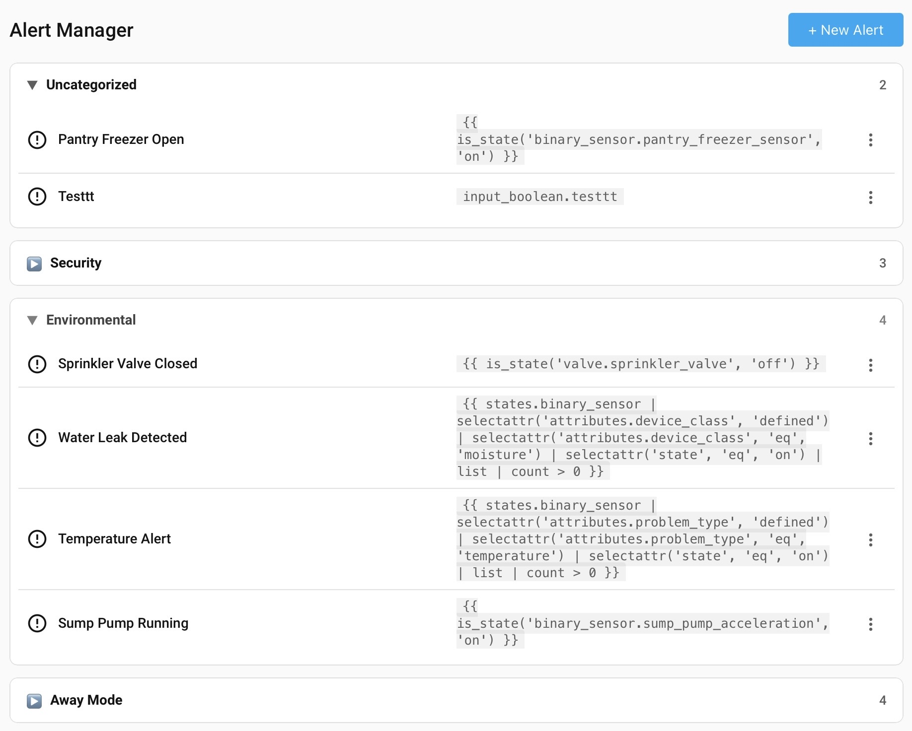

# HA Alerts

A powerful, UI-driven alert system for Home Assistant. Monitor conditions, send rich notifications, and manage everything from a dedicated sidebar panel — or automate it all with services.

---

## Features

- **Sidebar panel** — Dedicated UI with a live alert list, categories, and per-alert actions
- **Condition-based triggering** — Any Jinja2 template. When it evaluates to `true`, the alert fires
- **Rich notifications** — Send to any HA notify service. Supports **Markdown formatting** in message, title, and restore message fields
- **Repeat notifications** — Keep alerting on an interval until acknowledged or condition clears
- **Enable / Disable** — Pause individual alerts without deleting them. Re-enabling immediately evaluates the condition — if it's already true, the alert fires instantly
- **Categories** — Organize alerts into groups in the panel
- **Target selector** — Pick from all available notify services in the UI

---

## Installation

### HACS (recommended)

1. In HACS → **Integrations** → ⋮ → **Custom repositories**
2. Add `https://github.com/disforw/HA-Alerts` as an **Integration**
3. Install **HA Alerts** and restart Home Assistant

---

## Configuration

After installation, go to **Settings → Devices & Services → Add Integration → HA Alerts** to set up the integration. Individual alerts are created and managed from the **HA Alerts** sidebar panel.

---

## Services

HA Alerts exposes five services, making it fully controllable via automations, scripts, and AI agents.

| Service | Description |
|---|---|
| `ha_alerts.add` | Create a new alert |
| `ha_alerts.remove` | Delete an alert by ID |
| `ha_alerts.update` | Update an existing alert (partial update supported) |
| `ha_alerts.enable` | Enable a disabled alert |
| `ha_alerts.disable` | Disable an alert without deleting it |

### 🤖 AI Agent Friendly

All alerts are manageable via services — no UI required. AI assistants and automation agents can create, update, enable, disable, and remove alerts programmatically. Pair this with Home Assistant's conversation agent or any MCP-compatible tool for a fully voice/agent-driven alert workflow.

---

## Credits

- Backend based on the original [ha_alerts](https://github.com/disforw/HA-Alerts/tree/v1.3-stable) integration
- Panel UI inspired by [gleanlux/alertsys](https://github.com/gleanlux/alertsys)
- Maintained by [@disforw](https://github.com/disforw)
